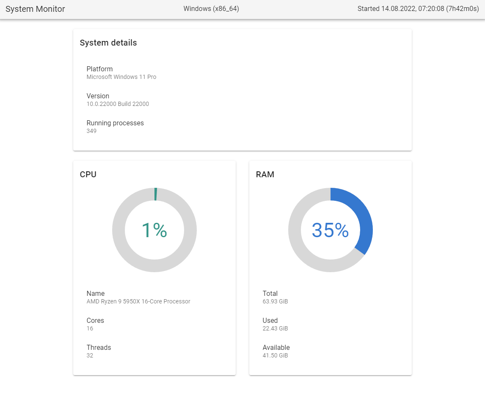
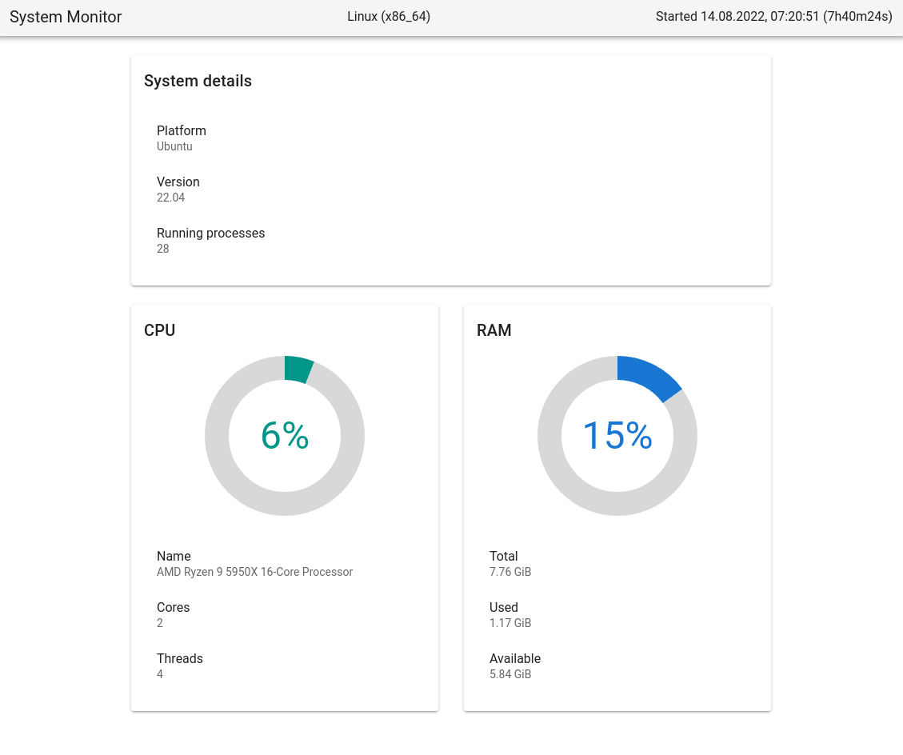

# Web GUI Example

An example of creating a web GUI for a desktop Go application that compiles into a single executable file
and opens in the default browser.

<br>

Structure:
```
/public — frontend (GUI)
/server — API backend (local server)
/src — main app logic (business layer)
```

Build:
```shell
go build web_gui_example.go
```

Run:
```shell
go run web_gui_example.go
```

Flags:
```
  -d    Run in debug mode
  -p uint
        A port for the local app server between 1024 and 49151 (default 8099)
```

<br>

Just as an example, the system monitor app with live update:

On Windows:


On Ubuntu (under WSL2):
